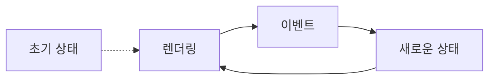
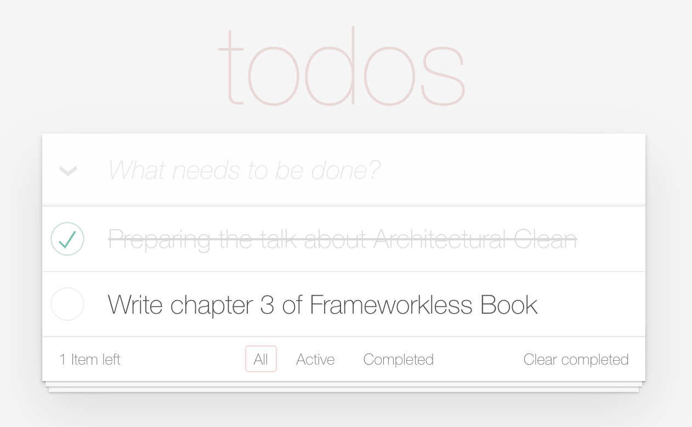

# 03. DOM 이벤트 관리

책 3장 DOM 이벤트 관리 부분을 구현하는 가이드입니다.

## 이벤트 처리 아키텍처

## 관리해야 하는 이벤트

관리해야 하는 이벤트는 모두 7개입니다.

- Todo 항목 삭제: 행의 오른쪽에 있는 십자가를 클릭한다.
- Todo 항목의 완료 여부 토글: 행의 왼쪽에 있는 원을 클릭한다.
- 필터 변경: 하단의 필터 이름을 클릭한다.
- Todo 항목 생성: 상단 입력 텍스트에 값을 입력하고 키보드의 Enter를 누른다.
- 완료한 모든 Todo 항목 삭제: `Clear completed` 레이블을 클릭한다.
- 모든 Todo 항목의 완료 여부 토글: 왼쪽 상단 모서리에 있는 `V` 표시를 클릭한다.
- Todo 항목 편집: 행을 더블 클릭하고 값을 변경한 후 키보드에서 Enter를 누른다.

## 구현 가이드

- [x] `index.js`의 `event` 객체에 올바른 이벤트 핸들러를 작성해주세요.

  - 각 이벤트 핸들러는 사용자의 이벤트가 발생하면 상태를 업데이트하고 다시 렌더링을 진행합니다.

- [x] `event` 객체에 작성한 이벤트 핸들러를 올바른 DOM 요소에 연결해주세요.

  - [x] `addItem`, `completeAll`, `clearCompleted` 핸들러는 `app.js` 구성 요소에 연결해야 합니다.
  - [x] `changeFilter` 핸들러는 `filters.js` 구성 요소에 연결해야 합니다.
  - [x] `deleteItem`, `toggleItemCompleted`, `updateItem` 핸들러는 `todos.js` 구성 요소에 연결해야 합니다.

- [x] 상태에 따라 올바른 DOM 요소를 반환할 수 있도록 구성 요소를 수정해주세요.

  - `app.js` 구성 요소

    - [x] 완료하지 않은 Todo 항목이 있다면 `Clear completed` 레이블이 보이지 않아야 합니다.
    - [x] 왼쪽 상단 모서리에 있는 V 표시를 클릭하면 V 표시가 체크되어야 합니다.

  - `todos.js` 구성 요소
    - [x] `currentFilter` 상태에 따라 올바른 Todo 항목만을 반환해야 합니다.

## 덧붙임

- 로컬 환경에서 의도한대로 작동하는지 확인해보세요.
- 코드 맥락만 맞다면 자유롭게 import / export 하셔도 됩니다.
- 테스트 코드에 케이스는 추가 가능하나, 기존 테스트 코드를 변경하지는 말아주세요.
