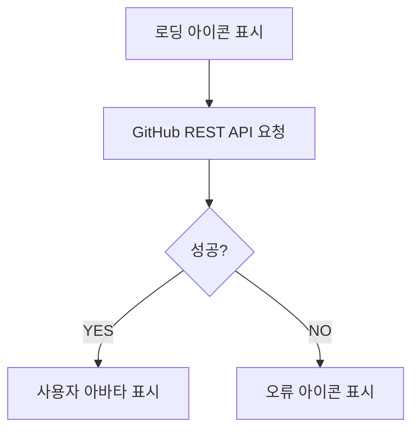

# 04. 웹 구성 요소 - GitHubAvatar

책 4장 웹 구성요소 - `GitHubAvatar` 부분을 구현하는 가이드입니다.

## GithubAvatar 구성 요소의 순서도

## 구현 가이드

- [ ] `components/GitHubAvatar.js` 파일의 `GitHubAvatar` Custom Element Class를 완성해주세요.

  - [ ] `user` 속성이 마크업과 동기화 될 수 있도록 getter/setter를 이용해 관리해야합니다.
  - [ ] `connectedCallback()` 라이프 사이클 메서드에서는 `img` 요소를 렌더링하고 GitHub API에 요청을 보내야 합니다.

- [ ] GitHub API 요청 결과에 따라 `GitHubAvatar` 구성 요소의 컨텐츠가 달라져야 합니다.

  - API 요청 전

    - [ ] 미리 주어진 `LOADING_IMAGE` 아이콘을 표시합니다.

  - API 요청 성공 시

    - [ ] GitHub API 응답 결과인 `avatar_url`을 이용하여 사용자 아바타를 표시합니다.

  - API 요청 실패 시
    - [ ] 미리 주어진 `ERROR_IMAGE` 아이콘을 표시합니다.

- [ ] GitHub API 요청 결과에 따라 커스텀 이벤트가 발생해야 합니다.

  - API 요청 성공 시

    - [ ] `AVATAR_LOAD_COMPLETE` 커스텀 이벤트를 발생시킵니다.
    - [ ] 커스텀 이벤트 생성 시 `avatar_url`을 추가적인 데이터로 전달합니다.

  - API 요청 실패 시
    - [ ] `AVATAR_LOAD_ERROR` 커스텀 이벤트를 발생시킵니다.
    - [ ] 커스텀 이벤트 생성 시 에러 객체를 추가적인 데이터로 전달합니다.

## 예시 코드

[Chapter04-GitHubAvatar](https://github.com/Apress/frameworkless-front-end-development/tree/master/Chapter04/00.5)

## 덧붙임

- 로컬 환경에서 `index.html`을 열어 작동하는지 확인해보세요.
- 코드 맥락만 맞다면 자유롭게 import / export 하셔도 됩니다.
- 테스트 코드에 케이스 추가는 가능하나, 기존 테스트 코드를 변경하지는 말아주세요.
